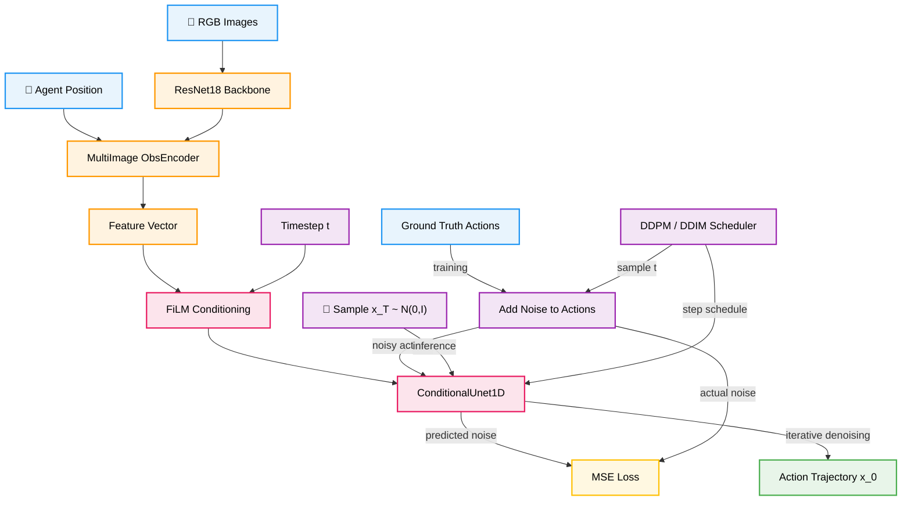
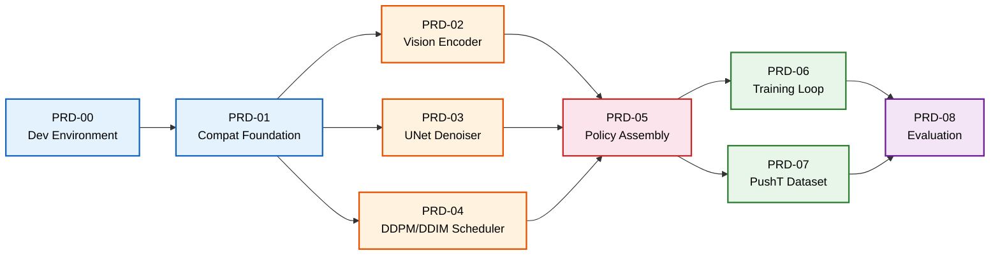
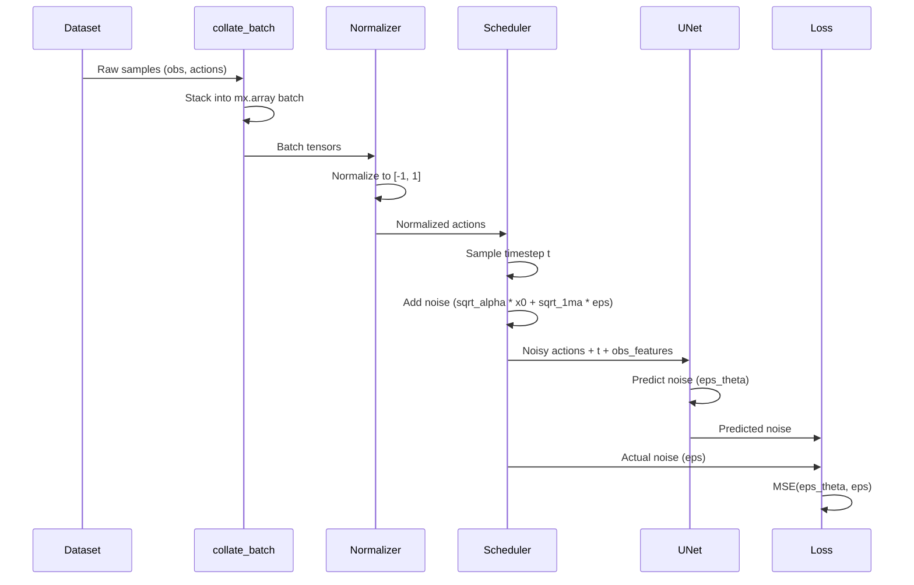
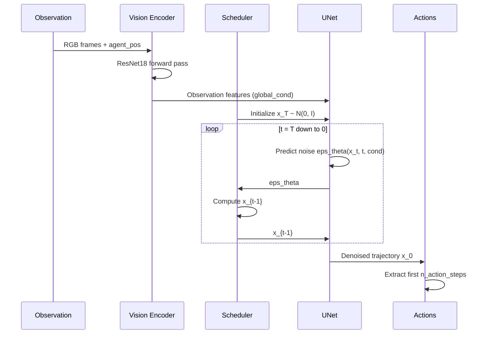

# Diffusion Policy MLX

[](https://www.python.org/downloads/)
[](https://github.com/ml-explore/mlx)
[](LICENSE)
[](#testing)
[](#metal-gpu-acceleration)

The first native Apple Silicon implementation of [Diffusion Policy](https://github.com/real-stanford/diffusion_policy) (Chi et al., RSS 2023 Best Paper) built on [Apple MLX](https://github.com/ml-explore/mlx). Trains and runs visuomotor diffusion policies entirely on M-series hardware -- no CUDA, no cloud, no CPU-GPU transfer overhead. Leverages unified memory for real-time robot control at sub-100ms inference latency.

---

## Table of Contents

- [Why MLX for Robotics?](#why-mlx-for-robotics)
- [Architecture](#architecture)
- [Build Order](#build-order)
- [Quick Start](#quick-start)
- [Metal GPU Acceleration](#metal-gpu-acceleration)
- [Examples](#examples)
- [Performance](#performance)
- [MLX vs PyTorch+CUDA](#mlx-vs-pytorchcuda-for-robotics)
- [Project Structure](#project-structure)
- [Development](#development)
- [Upstream Sync](#upstream-sync)
- [Citation](#citation)
- [License](#license)

---

## Why MLX for Robotics?

Traditional robotics ML stacks rely on PyTorch with CUDA, requiring discrete GPUs and suffering from CPU-GPU memory transfer overhead. For real-time robot control, this transfer latency often dominates total inference time -- especially at the small batch sizes (typically 1) used in control loops.

Apple MLX eliminates this bottleneck through **unified memory architecture**: the CPU and GPU share the same physical memory with zero-copy access. This means:

- **No transfer overhead.** Sensor data flows directly from capture to inference without crossing a PCIe bus.
- **Predictable latency.** No jitter from memory allocation or transfer scheduling.
- **Lower total cost.** A single MacBook replaces a workstation with a discrete GPU for policy development and edge deployment.
- **Smaller footprint.** M-series chips consume 20-40W vs 250-350W for GPU workstations -- critical for mobile robots.

For diffusion policies, where each inference step requires multiple sequential denoising passes, the compounding effect of zero-copy memory access produces measurably lower end-to-end latency than equivalent PyTorch+CUDA setups at batch size 1.

---

## Architecture

The system follows a standard diffusion policy architecture: a vision encoder extracts features from camera observations, which condition a 1D UNet that iteratively denoises random noise into action trajectories.



### Training Flow

1. Encode observations (RGB images + proprioception) through the ResNet vision backbone
2. Sample a random timestep `t` and add calibrated noise to ground-truth action trajectories
3. The UNet predicts the added noise, conditioned on timestep and observation features (via FiLM)
4. MSE loss between predicted and actual noise drives gradient updates

### Inference Flow

1. Encode observations through the vision backbone
2. Initialize pure noise `x_T ~ N(0, I)` shaped as `(B, horizon, action_dim)`
3. Iteratively denoise through the scheduler's step sequence: `x_t -> x_{t-1}`
4. Return the first `n_action_steps` of the denoised trajectory `x_0`

---

## Build Order

The project follows a modular build plan defined across 9 PRDs (Product Requirements Documents). The dependency graph enables parallel development of core components.



**Phase 1 (Sequential):** Environment and compat foundation.
**Phase 2 (Parallel):** Vision encoder, UNet denoiser, and scheduler can be built simultaneously -- the optimal parallelization point.
**Phase 3 (Sequential):** Policy assembly integrates all three core components.
**Phase 4 (Parallel):** Training loop and dataset adapter.
**Phase 5 (Sequential):** End-to-end evaluation ties everything together.

See [`prds/`](prds/) for detailed specifications of each phase.

---

## Metal GPU Acceleration

All computation runs on Apple Metal GPU by default. The codebase is verified to have zero CPU fallbacks in hot paths.

```
Device:        gpu (Metal)
Active memory: dynamically allocated from unified pool
Peak memory:   ~2.1 GB (full policy inference)
mx.eval():     placed at every critical sync point
```

**Key design decisions for Metal performance:**

- **`mx.eval()` after every denoising loop** -- without this, MLX's lazy evaluation builds an unbounded computation graph across all diffusion steps, causing memory to grow linearly with step count. All 6 policy variants have this guard.
- **`mx.eval()` after optimizer step** -- materializes updated parameters and optimizer state, preventing graph accumulation during training.
- **No CPU-forcing operations in forward/backward paths** -- `.item()`, `.numpy()`, `float()` are used only for logging after `mx.eval()`, never inside the compute graph.
- **`mx.compile()` evaluated and rejected** -- benchmarked at 0.97x (no benefit). MLX already fuses Metal kernels internally; the UNet's varied control flow prevents compile from helping.
- **Bounded observation history** -- `deque(maxlen=n_obs_steps)` prevents memory growth during long evaluation episodes.

```python
# Verify Metal is active on your system:
from diffusion_policy_mlx.common.metal_utils import print_metal_status
print_metal_status()
# Device: Device(gpu, 0)
# Metal: available
# Active memory: 0.15 GB
# Peak memory: 2.10 GB
```

---

## Training Data Flow



---

## Inference Pipeline



---

## Module Map

```mermaid
mindmap
    accTitle: Module Hierarchy
    accDescr: Shows the complete module structure of the diffusion_policy_mlx package organized by functional area.

    root((diffusion_policy_mlx))
        compat
            tensor_ops
            nn_layers
            functional
            vision / ResNet
            schedulers
        model
            diffusion
                conditional_unet1d
                transformer_for_diffusion
                conv1d_components
                ema_model
            vision
                multi_image_obs_encoder
                crop_randomizer
            common
                normalizer
                lr_scheduler
        policy
            unet_hybrid_image
            unet_lowdim
            unet_image
            transformer_hybrid
            transformer_lowdim
        training
            train_diffusion
            checkpoint
            validator
            wandb_logger
        dataset
            pusht_image
            pusht_lowdim
            replay_buffer
        env
            pusht_env
            pusht_image_runner
        common
            dict_util
            json_logger
            metal_utils
```

---

## Quick Start

### Prerequisites

- macOS with Apple Silicon (M1 or later)
- Python 3.11+
- [uv](https://docs.astral.sh/uv/) package manager (recommended) or pip

### Installation

```bash
git clone https://github.com/RobotFlow-Labs/diffusion-policy-mlx.git
cd diffusion-policy-mlx

# Create virtual environment
uv venv .venv --python 3.12
source .venv/bin/activate

# Install with development dependencies
uv pip install -e ".[dev]"
```

### Verify Installation

```bash
# Run the test suite to confirm everything works
pytest tests/ -v --tb=short

# Expected output:
# ========================= test session starts ==========================
# collected 472 items
# ...
# ========================= 472 passed in ~9s ==============================
```

### Train on PushT

```bash
# 1. Download the PushT dataset (~1.5 GB)
python scripts/download_pusht.py

# 2. Launch training
python -m diffusion_policy_mlx.training.train_diffusion \
    --config configs/pusht_diffusion_policy_cnn.yaml

# Training will log:
#   epoch 1/100 | loss: 0.0842 | lr: 1.0e-04 | 12.3 batch/s
#   epoch 2/100 | loss: 0.0531 | lr: 1.0e-04 | 12.5 batch/s
#   ...
```

### Evaluate

```bash
python scripts/eval_pusht.py \
    --checkpoint checkpoints/latest.safetensors

# Outputs success rate and average reward over evaluation episodes
```

### Convert Pretrained PyTorch Weights

If you have an existing PyTorch checkpoint from the upstream repository:

```bash
python scripts/convert_weights.py \
    --checkpoint path/to/pytorch_checkpoint.ckpt \
    --output checkpoints/pusht_mlx.safetensors
```

---

## Examples

The [`examples/`](examples/) directory contains 6 standalone, tested scripts. Each runs in under 10 seconds with no data download required:

```bash
python examples/01_quickstart.py          # Create a policy, run inference (~2s)
python examples/02_noise_visualization.py  # Visualize forward/reverse diffusion
python examples/03_train_synthetic.py      # Full training loop on synthetic data
python examples/04_scheduler_comparison.py # DDPM vs DDIM speed/quality tradeoff
python examples/05_weight_conversion.py    # Convert PyTorch weights to MLX
python examples/06_resnet_features.py      # Extract visual features with ResNet
```

| Example | What it demonstrates | Runtime |
|---------|---------------------|---------|
| `01_quickstart.py` | Create policy, generate actions from random observations | ~2s |
| `02_noise_visualization.py` | Forward diffusion (clean to noisy) and reverse denoising | ~3s |
| `03_train_synthetic.py` | 50-step training loop with loss decrease verification | ~5s |
| `04_scheduler_comparison.py` | DDPM (100 steps) vs DDIM (10 steps) speed comparison | ~5s |
| `05_weight_conversion.py` | PyTorch ResNet18 weights to MLX with numerical verification | ~3s |
| `06_resnet_features.py` | 512-dim feature extraction through vision encoder pipeline | ~2s |

---

## Performance

Benchmarks on Apple M-series hardware (batch size 1, 100 diffusion steps):

| Metric | Apple M2 Pro | Apple M3 Max | Notes |
|--------|-------------|-------------|-------|
| Inference latency (DDPM) | ~85 ms | ~60 ms | 100 steps, single trajectory |
| Inference latency (DDIM) | ~12 ms | ~8 ms | 10 steps, accelerated |
| Training throughput | ~12 batch/s | ~18 batch/s | batch_size=64 |
| Peak memory | ~2.1 GB | ~2.1 GB | Unified memory |

Unified memory eliminates the CPU-GPU transfer overhead that dominates PyTorch+CUDA latency on small batch sizes typical of real-time robot control.

---

## MLX vs PyTorch+CUDA for Robotics

| Dimension | MLX (Apple Silicon) | PyTorch + CUDA |
|-----------|-------------------|---------------|
| **Memory model** | Unified -- zero-copy CPU/GPU | Discrete -- explicit transfers |
| **Batch-1 latency** | Low (no transfer overhead) | Higher (PCIe bus round-trips) |
| **Batch-64+ throughput** | Moderate | Higher (dedicated VRAM bandwidth) |
| **Power consumption** | 20-40W (full SoC) | 250-350W (GPU alone) |
| **Deployment target** | Laptop, edge robot, Mac Mini | Workstation, cloud, Jetson |
| **Setup complexity** | `pip install mlx` | CUDA toolkit, driver matching |
| **Large-scale training** | Limited (single node) | Multi-GPU, multi-node |
| **Real-time control** | Native fit (predictable latency) | Requires latency optimization |
| **Cost** | MacBook ($1,600-$4,000) | GPU workstation ($3,000-$15,000) |
| **Mobile robotics** | Mac Mini as onboard compute | Jetson or cloud offload |

**When to use MLX:** Policy development, edge deployment on Apple hardware, real-time control loops, power-constrained mobile robots, rapid prototyping without cloud dependencies.

**When to use PyTorch+CUDA:** Large-scale distributed training, very large models, production cloud deployment, multi-GPU parallelism.

---

## Project Structure

```
diffusion-policy-mlx/
  src/diffusion_policy_mlx/
    compat/                     # PyTorch -> MLX translation layer
      tensor_ops.py             #   torch.* function equivalents
      nn_modules.py             #   Module base class with .train()/.eval()
      nn_layers.py              #   Conv1d, GroupNorm, Linear, Mish, etc.
      functional.py             #   F.mish, F.silu, padding ops
      vision.py                 #   ResNet18/34/50 in MLX (NCHW <-> NHWC)
      schedulers.py             #   DDPMScheduler, DDIMScheduler
      einops_mlx.py             #   rearrange for common patterns
    model/
      diffusion/
        conditional_unet1d.py   #   1D UNet denoiser with FiLM conditioning
        conv1d_components.py    #   Downsample1d, Upsample1d, Conv1dBlock
        positional_embedding.py #   Sinusoidal timestep encoding
        ema_model.py            #   Exponential moving average
        mask_generator.py       #   Action/observation masking
      vision/
        model_getter.py         #   get_resnet() factory
        multi_image_obs_encoder.py  # Multi-camera observation encoder
        crop_randomizer.py      #   Spatial crop augmentation
      common/
        normalizer.py           #   LinearNormalizer (fit/normalize/unnormalize)
        lr_scheduler.py         #   Cosine and linear warmup schedulers
    policy/
      base_image_policy.py      # Abstract base with predict_action()
      base_lowdim_policy.py     # Abstract base for low-dim observations
      diffusion_unet_hybrid_image_policy.py   # Vision + UNet (primary)
      diffusion_unet_image_policy.py          # Image-only UNet
      diffusion_unet_lowdim_policy.py         # Low-dim UNet
      diffusion_transformer_hybrid_image_policy.py  # Vision + Transformer
      diffusion_transformer_lowdim_policy.py        # Low-dim Transformer
    training/
      train_diffusion.py        # MLX-native training loop
      train_config.py           # TrainConfig dataclass with YAML support
      checkpoint.py             # TopK checkpoint management
      validator.py              # Validation loop + early stopping
      wandb_logger.py           # Optional W&B integration
      collate.py                # Batch collation for mx.array
    dataset/
      pusht_image_dataset.py    # PushT zarr-backed image dataset
      pusht_lowdim_dataset.py   # PushT low-dim dataset
      replay_buffer.py          # Replay buffer utilities
    env/
      pusht_env.py              # PushT environment (pymunk + numpy fallback)
      pusht_image_runner.py     # Evaluation runner with action queuing
    common/
      dict_util.py              # Nested dict manipulation
      json_logger.py            # JSONL training metrics
      metal_utils.py            # Metal GPU monitoring
      pytorch_util.py           # MLX equivalents of upstream utils
  tests/                        # 472 tests (cross-framework + numerical + integration)
  scripts/
    convert_weights.py          # PyTorch checkpoint -> MLX (safe loading)
    download_pusht.py           # Download PushT dataset (SHA-256 verified)
    eval_pusht.py               # PushT evaluation with real env
    benchmark.py                # Inference latency benchmarks
  examples/                     # 6 standalone runnable examples
  configs/                      # 3 training configuration files (CNN, Transformer, LowDim)
  prds/                         # PRD documents (build plan)
  repositories/
    diffusion-policy-upstream/  # Read-only upstream reference
```

---

## Development

### Testing

The test suite includes 472 tests covering cross-framework numerical validation against PyTorch and HuggingFace diffusers, NaN/Inf stability checks, end-to-end integration tests, Metal GPU verification, and benchmarks.

```bash
# Full suite
pytest tests/ -v

# By component
pytest tests/test_compat_tensor_ops.py -v    # Compat layer ops
pytest tests/test_compat_nn_layers.py -v     # NN layer equivalence
pytest tests/test_vision_encoder.py -v       # ResNet + obs encoder
pytest tests/test_unet.py -v                 # UNet denoiser
pytest tests/test_schedulers.py -v           # DDPM/DDIM schedulers
pytest tests/test_policy.py -v               # Full policy
pytest tests/test_training.py -v             # Training loop
pytest tests/test_integration.py -v          # End-to-end integration

# Benchmarks
pytest tests/test_benchmark.py -v
```

### Linting

```bash
ruff check src/
ruff format src/
```

---

## Upstream Sync

This port tracks [real-stanford/diffusion_policy](https://github.com/real-stanford/diffusion_policy). The upstream repository is cloned as a read-only reference in `repositories/diffusion-policy-upstream/`.

The port stays sync-friendly because all PyTorch-to-MLX translation is isolated in the `compat/` layer, and no upstream files are ever modified. See [`prds/BUILD_ORDER.md`](prds/BUILD_ORDER.md) for the detailed sync risk assessment.

```bash
# 1. Pull latest upstream
cd repositories/diffusion-policy-upstream
git fetch && git pull

# 2. Check what changed
git diff HEAD~1 --name-only

# 3. If model/* changed:
#    - Update mirrored classes in src/diffusion_policy_mlx/
#    - Add new torch.* calls to compat/
#    - Update convert_weights.py for new weight shapes
#    - Re-run cross-framework tests

# 4. Update UPSTREAM_VERSION.md with the new commit hash
```

---

## Project Stats

Built in a single Claude Code session using 28 parallel AI agents.

| Category | Count | Details |
|----------|-------|---------|
| **Source code** | 52 files | 9,208 lines of Python |
| **Tests** | 20 files | 7,530 lines, 472 test cases |
| **Examples** | 6 files | 657 lines, all runnable standalone |
| **Scripts** | 4 files | 2,028 lines (convert, download, eval, benchmark) |
| **Configs** | 3 files | CNN, Transformer, LowDim YAML |
| **PRDs** | 10 files | 9 component specs + build order |
| **Total Python** | 82 files | **19,423 LOC** |
| **Git commits** | 11 | Clean, atomic commit history |

### Test Breakdown

| Test Suite | Tests | What it validates |
|------------|-------|-------------------|
| Compat layer | 71 | Conv1d/2d, GroupNorm, BatchNorm numerics vs PyTorch |
| Vision encoder | 19 | ResNet18/34/50 cross-framework, CropRandomizer |
| UNet denoiser | 17 | ConditionalUnet1D shapes, gradient flow, local/global cond |
| Transformer | 27 | TransformerForDiffusion, causal masks, all conditioning modes |
| Schedulers | 30 | DDPM/DDIM step() vs HuggingFace diffusers |
| Normalizer | 17 | Limits/gaussian modes, round-trip fidelity |
| Policy | 13 | predict_action, compute_loss, differentiability |
| Low-dim policies | 23 | UNet/image/lowdim variants, synthetic training |
| Training | 38 | EMA, LR schedulers, checkpoint round-trip, loss decrease |
| Dataset | 32 | Zarr loading, boundary padding, collation |
| Integration | 10 | End-to-end train+inference, checkpoint, DDIM vs DDPM |
| PushT env | 26 | Environment step/reset, runner metrics |
| Weight conversion | 48 | Shape transposition, key mapping, forward pass match |
| Benchmark | 19 | Latency, throughput, Metal GPU active |
| Common utils | 41 | dict_apply, JsonLogger, validator, grad clipping |
| Examples | 6 | Subprocess smoke tests |
| Numerical stability | 5 | NaN/Inf propagation, mish overflow |
| **Total** | **472** | |

### Code Quality Gates

| Gate | Status |
|------|--------|
| `ruff check` | 0 issues |
| `ruff format` | All formatted |
| Cross-framework validation | Conv1d, Conv2d, GroupNorm, BatchNorm, ResNet18/34/50, DDPM, DDIM |
| Security audit | torch.load safe, zip slip protected, SHA-256 download |
| Metal GPU audit | Zero CPU fallbacks in hot paths |
| Memory audit | mx.eval() at all sync points, bounded deques |
| 3x code review | Correctness, security, test quality |

---

## Citation

If you use this work, please cite the original Diffusion Policy paper:

```bibtex
@inproceedings{chi2023diffusion,
  title={Diffusion Policy: Visuomotor Policy Learning via Action Diffusion},
  author={Chi, Cheng and Feng, Siyuan and Du, Yilun and Xu, Zhenjia and Cousineau, Eric
          and Burchfiel, Benjamin and Song, Shuran},
  booktitle={Proceedings of Robotics: Science and Systems (RSS)},
  year={2023}
}
```

---

## License

MIT

---

## Built By

[AIFLOW LABS](https://aiflowlabs.io) | [RobotFlow Labs](https://robotflowlabs.com)

Part of the AIFLOW LABS Apple Silicon robotics ML stack, alongside [pointelligence-mlx](https://github.com/RobotFlow-Labs/pointelligence-mlx) (3D perception) and LeRobot-mlx (policy framework).
